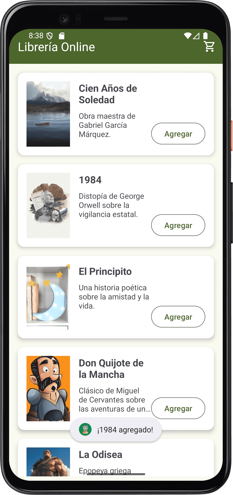

# Aplicación Librería Online - Evaluación Final

## Descripción
Esta aplicación es un prototipo de una librería online para Android. Permite a los usuarios explorar una lista de libros, ver los detalles de un libro seleccionado y agregarlo a un carrito.

## Tecnologías y Herramientas
- **Lenguaje:** Java
- **IDE:** Android Studio (Narwhal 3 Feature Drop | 2025.1.3)
- **API Mínima:** 21 (Android 5.0)
- **API Objetivo:** 36 (Android 16)
- **Diseño:** Material Design 3
- **Control de Versiones:** Git / GitHub

## Cómo Ejecutar el Proyecto
1.  Clona este repositorio.
2.  Abre el proyecto en Android Studio.
3.  Sincroniza los archivos Gradle.
4.  Conecta un dispositivo físico o inicia un emulador (recomendado: Pixel 4, API 34).
5.  Haz clic en el botón "Run" (▶️).

## Capturas de Pantalla

]
]

## Decisiones de Desarrollo
- Se eligió **Java** por ser el lenguaje solicitado.
- Se implementó **Material Design 3** para una interfaz moderna y atractiva.
- Se utilizó `RecyclerView` para una lista eficiente y escalable.
- La navegación entre actividades se realiza mediante `Intent` con paso de datos primitivos (`String`, `int`), que es la forma más sencilla y adecuada para este caso.
- El código sigue principios de **POO** (clase `Libro`) y **Clean Code** (nombres descriptivos, métodos cortos, separación de responsabilidades en el `Adapter`).

## Gestión de Código en GitHub
- El proyecto se gestiona en este repositorio remoto.
- Se utiliza la rama `main` como rama principal.
- El archivo `.gitignore` asegura que solo se suban los archivos fuente y de configuración necesarios, manteniendo el repositorio limpio y seguro.

### Contexto y Tecnologías Móviles

En el desarrollo de aplicaciones móviles Android, se utilizan diversas tecnologías y herramientas esenciales:

1.  **Android Studio:** Es el Entorno de Desarrollo Integrado (IDE) oficial para Android. Proporciona un editor de código inteligente, un emulador potente, herramientas de depuración y un sistema de compilación basado en Gradle. Es fundamental para escribir, probar y depurar el código.

2.  **Java/Kotlin:** Son los lenguajes de programación principales para desarrollar aplicaciones nativas en Android. Java, utilizado en este proyecto, es un lenguaje orientado a objetos robusto y maduro con una vasta comunidad y documentación.

3.  **Material Design 3 (MD3):** Es el sistema de diseño visual de Google. Proporciona componentes, pautas de color, tipografía y animaciones coherentes que garantizan una experiencia de usuario intuitiva, moderna y visualmente atractiva. En este proyecto, se aplican los componentes de MD3 para crear una interfaz de usuario de alta calidad.

### Configuración Inicial del Proyecto en Android Studio

Para crear un nuevo proyecto nativo en Android Studio, se siguieron estos pasos esenciales:

1.  **Tipo de Proyecto:** Se seleccionó la plantilla "Empty Views Activity". Esta plantilla proporciona una estructura básica con una `MainActivity` y un archivo de layout (`activity_main.xml`), ideal para comenzar desde cero con una interfaz basada en vistas.

2.  **Versión Mínima de Android (minSdkVersion):** Se configuró en la API 21 (Android 5.0, Lollipop). Esta decisión se tomó para aprovechar características modernas de la plataforma y de Material Design 3, manteniendo una cobertura de dispositivos superior al 90%. Se define en el archivo `app/build.gradle`.

3.  **Nombre del Paquete y Lenguaje:** Se estableció un nombre de paquete único (`com.abpro_ae4.libreriaonlineapp`) y se seleccionó **Java** como lenguaje de programación principal.

### Manejo de Assets y Recursos

Los recursos en Android se gestionan en directorios específicos dentro de la carpeta `res/`:

*   **Imágenes (`res/drawable/` y `res/mipmap/`):** Las imágenes de la interfaz (como las portadas de libros) se colocan en `res/drawable/`. Las imágenes de íconos de la app (como el launcher icon) van en `res/mipmap/`. Se utilizan diferentes carpetas de densidad (hdpi, xhdpi, etc.) para que el sistema elija la imagen adecuada según la pantalla del dispositivo, optimizando el rendimiento y el consumo de memoria.

*   **Fuentes (`res/font/`):** Las fuentes personalizadas se colocan en este directorio. Se pueden definir en XML y luego aplicar a los TextViews mediante el atributo `android:fontFamily`.

*   **Archivos Genéricos (`assets/`):** Este directorio (al mismo nivel que `res/`) se usa para archivos que no se pueden compilar en recursos, como archivos de texto, JSON, o bases de datos pre-populadas. Se accede a ellos mediante `AssetManager`.

**Importancia de la Optimización:**
Optimizar los assets es crucial porque:
*   **Rendimiento:** Imágenes grandes o no comprimidas ralentizan la carga de la app y consumen mucha memoria RAM, lo que puede causar `OutOfMemoryError`.
*   **Tamaño de la APK:** Assets no optimizados aumentan innecesariamente el tamaño de la aplicación, lo que desalienta a los usuarios a descargarla.
*   **Experiencia de Usuario:** Una app lenta o que se cierra inesperadamente ofrece una mala experiencia.